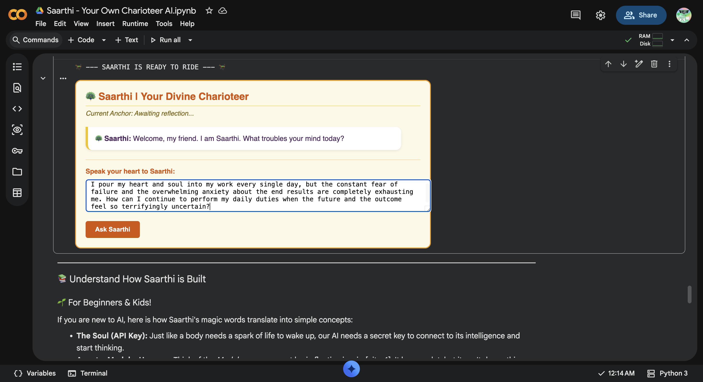
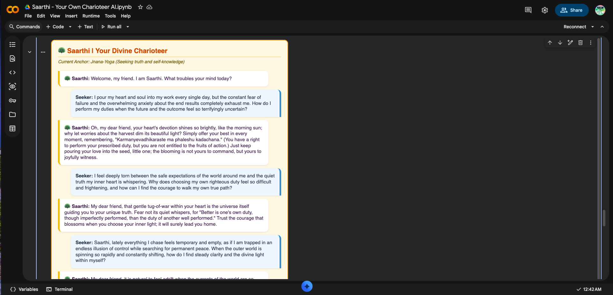
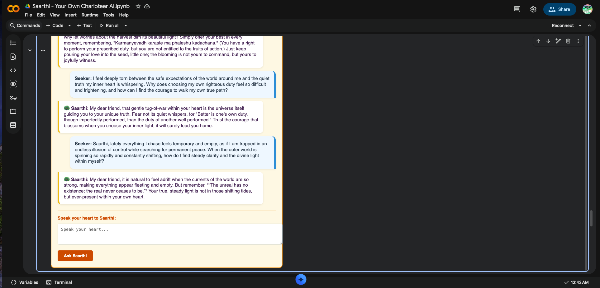

# 🦚 Saarthi - Your Own Charioteer AI 

**Kaggle 5-Day AI Agents Intensive Vibe Coding Course With Google Capstone Project | Concierge Agents Track**

## 📖 Project Overview
Modern life is filled with invisible battles: burnout, severe stress, and career anxiety. In the epic Mahabharata, when Arjuna was overwhelmed on the battlefield, Lord Shri Krishna stepped in as his *Saarthi* (Charioteer)—not to fight the war for him, but to provide the philosophical clarity needed to proceed. 

**Saarthi AI** is a stateful, context-engineered philosophical guide built to be that steadfast companion for modern seekers. Operating under the **Concierge Agents Track**, it processes complex emotional dilemmas and delivers wisdom from the *Bhagavad Gita*. Crucially, it operates within a strict zero-trust perimeter, ensuring absolute data privacy and strictly refusing to make unauthorized medical or clinical inferences.

## 📸 Project Showcase & Verification
*(Note: If images do not appear immediately, ensure they are renamed in the repository to `demo1.png`, `demo2.png`, and `demo3.png`)*

### Image 00 

### Image 01

### Image 02

### Image 03

---

## ⚙️ Technical Architecture (Agentic Engineering)
This project abandons casual, unstructured "vibe coding" in favor of strict, production-grade **Agentic Engineering**[cite: 1]. It perfectly implements the core paradigm: `Agent = Model + Harness`[cite: 1].

The architecture is divided into 7 distinct biological metaphors to make the engineering accessible:

### 1. The Soul (Zero-Trust Identity)
We utilize secure secrets management (Google Colab Secrets) to establish LLM identity. This prevents unauthorized ambient access and mitigates the Confused Deputy problem by never hardcoding API keys in the execution environment.

### 2. The DNA (Spec-Driven Development)
To eliminate prompt ambiguity and the reasoning "format tax", the agent is guided by an absolute architectural North Star. It utilizes a hybrid format: **Behavior-Driven Development (BDD)** specifications written in Gherkin syntax for narrative goals, alongside flat YAML blocks for tool configurations.

### 3. The Shield (Context Hygiene & Semantic Firewall)
Autonomous agents are prone to "Context Hallucination" and data leaks. Saarthi implements a strict Context Hygiene middleware. Regular expressions intercept execution turns to dynamically scrub Personally Identifiable Information (PII). Furthermore, a zero-tolerance Semantic Firewall actively blocks unprompted medical/clinical terminology, enforcing the Concierge Track's safety mandate.

### 4. The Brain (Asynchronous Memory ETL Loop)
To mitigate "context rot" and lower OpEx token burn over long conversations, the architecture strictly separates the chronological **Session** log from persistent **Memory**. An asynchronous ETL (Extract, Transform, Load) loop runs in the background to distill noisy chat history into a stable, consolidated philosophical anchor (e.g., *Dharma* or *Karma-Yoga*).

### 5. The Face (A2UI v0.9 Standard)
The agent does not emit raw text blocks or risky executable frontend code. Instead, it utilizes the **Agent-to-User Interface (A2UI v0.9)** standard. It safely outputs a framework-agnostic flat adjacency list of layout components (like `Column`, `Card`, and `TextField`). A native Javascript-to-Python bridge renders these JSON blueprints into beautiful, interactive HTML widgets dynamically.

### 6. The Conscience (Glass Box Trajectory Evaluation)
We do not rely on binary success metrics. A Glass Box Trajectory Evaluator simulates an **LLM-as-Judge** to score the agent's internal reasoning path. It verifies that the agent successfully triggered background memory tools and emitted valid A2UI schemas, continuously measuring for Intent Drift against rubrics derived directly from the user's opening prompt.

---

## 🚀 How to Run In Google Colab

1. Open the `Saarthi - Your Own Charioteer AI.ipynb` file in Google Colab.
2. Click on the 🔑 **Secrets** tab on the left sidebar.
3. Add a new secret named `GEMINI_API_KEY` and paste your Google Gemini API key. Ensure the "Notebook access" toggle is turned on.
4. Go to the top menu and select `Runtime > Run all`.
5. Scroll to the bottom cell to interact with Saarthi's live Canvas interface!

---
*Built for the 2026 Kaggle 5-Day AI Agents Intensive Vibe Coding Course With Google.*
